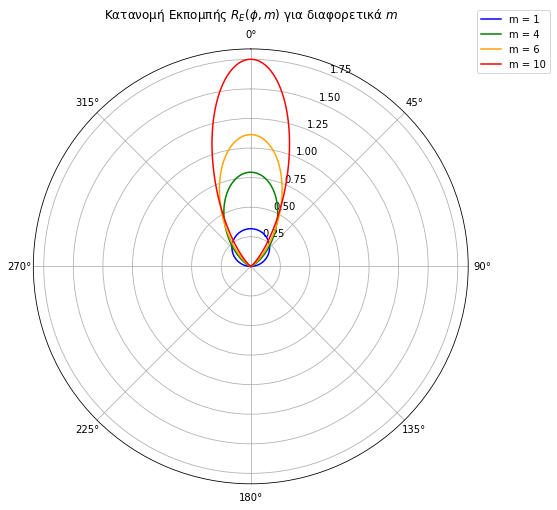
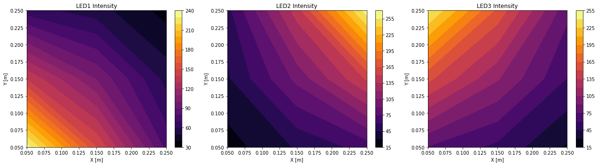
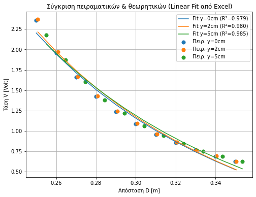

# VLC System Modeling

Simulation and modeling of Visible Light Communication (VLC) systems using Lambertian radiation patterns and Line-of-Sight (LOS) propagation models.

---

## Overview

This repository contains computational and experimental implementations related to indoor optical wireless communication systems using LED-based transmission models.

The project focuses on:
- Lambertian radiation modeling
- Optical power distribution analysis
- Experimental validation of VLC systems
- Least-squares fitting techniques
- Heatmap visualization of optical intensity
- Arduino-based transmitter and receiver implementations

---

## Key Results

- Experimentally validated Lambertian-based VLC propagation behavior in indoor environments.
- Observed strong dependence of received optical intensity on transmitter–receiver distance and incidence angle.
- Generated optical intensity heatmaps for LOS VLC configurations using computational modeling techniques.
- Compared theoretical propagation models with Arduino-based experimental measurements using least-squares fitting methods.
- Demonstrated practical feasibility of VLC-based indoor positioning systems (IPS) with positioning accuracy ranging from centimeters to decimeters under controlled conditions.
- Identified major sources of positioning error, including reflections, angular misalignment, ambient light interference, and receiver geometry effects.
- Evaluated the advantages of Optical Wireless Communications (OWC), including electromagnetic interference immunity, infrastructure reuse, and enhanced spatial security.

---

## Technologies

- Python
- NumPy
- Pandas
- Matplotlib
- SciPy
- Arduino

---


## Repository Structure

```text
src/        → Python notebooks and simulation scripts
images/     → Generated plots and visualizations
data/       → Experimental datasets and measurements
arduino/    → Arduino transmitter and receiver implementations
report/     → Thesis excerpts and supporting documentation

```

---

## How to Run

Install the required dependencies:

```bash
pip install -r requirements.txt
```

Run the simulation notebooks inside the `src/` directory using Jupyter Notebook or JupyterLab.

Example:

```bash
jupyter notebook
```

---

## Lambertian Radiation Modeling

Simulation of Lambertian emission patterns for different mode numbers \(m\).



---

## Optical Intensity Heatmaps

Heatmap visualization of received optical intensity distributions from multiple LED transmitters.



---

## Experimental vs Theoretical Analysis

Comparison between theoretical VLC propagation models and experimental measurements using least-squares fitting methods.



---

## Arduino-Based Measurements

Experimental acquisition of brightness values using Arduino-based optical transmission and reception setups.


---

## Author

**Christos Kapsalis**  
Physics graduate with a focus on Electronics, Telecommunications, and Computational Modeling of optical wireless communication systems.
